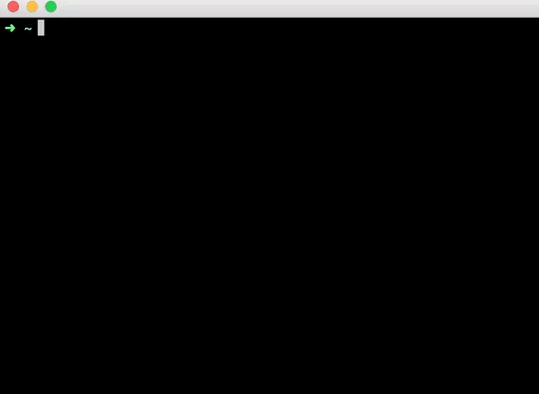

## ding
Ring a bell after command execution.Sometimes we have to do things in parallel especially when executing some command that needs for a long time such as building a docker image.We need a sound like ding after the job is done.  
                                                            
## Usage 
ding is very simple to use,you can put ding before any command like the gif below.

## *License*
This software is released under the Apache 2.0 license.

